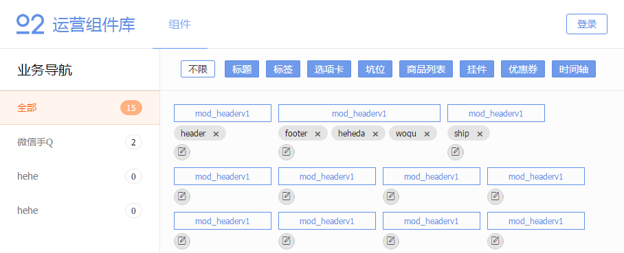

# Athena 组件平台

集合组件上传、组件拉取、和组件预览功能。

## 技术组成

- 前端 vue+webpack
- 后端 koa
- 数据存储 Leancloud

## 前端页面展示



## 部署指引

- 安装 NodeJS（建议版本>=6.0.0）
- 注册 Leancloud

``` bash
git clone https://github.com/o2team/athena-component.git

cd athena-component/src
npm install
npm install babel-cli -g
node install

cd app
npm install
```

- **前端配置**

修改main.js里的数据配置项

- **前端调试 ./src/app -> 运行后访问：http://localhost:8080**

``` bash
npm run dev
```

- **前端编译 ./src/app**

``` bash
npm run build
```

- **后端配置**

ac-config.js

- **hack修改**

背景：archiver 的 on('entry') 触发前时的状态已经是 finalize:true，即已经添加到压缩文件里了，但我们需要在文件添加到队列前重命名文件

**修改：**
	
`.src/node_modules/archiver/lib/core.js`

搜索 `Archiver.prototype._append = function(filepath, data)`

在它里面的第一行添加 `this.onBeforeAppend && this.onBeforeAppend(filepath, data);`，如下

``` javascript
Archiver.prototype._append = function(filepath, data) {
	this.onBeforeAppend && this.onBeforeAppend(filepath, data);
	/* ... */
};
```

如此，就可以在自己代码中自定义：

``` javascript
archive.onBeforeAppend = function(filePath, data) {
	// Do something. 这里是重命名
	data.name = new Date().getTime().toString();
}
```

后续：其实做到像 `on('beforeAppend', function() {})` 这样写，但还没摸透它，就酱

- **后端开发 ./src -> 运行后访问：http://localhost**

``` bash
npm run test
```

- **前后端双服务联调指引**

（待更新）

## API

总览：

- HTTP POST /api/push
- HTTP GET  /api/pull/:id/:rename?
- HTTP GET  /api/detail?id=xxx
- HTTP GET /api/detail-info?id=xxx

``` javascript
/**
 * HTTP POST /api/push
 * @description 上传组件
 *
 * @param {appId} <String> 应用ID
 * @param {moduleId} <String> 模块ID
 * @param {platform} <String> 平台 pc | h5
 * @param {widget} <String> zip组件打包文件
 * @param {author} <String> 作者，白名单校验
 * @param {description} [String] 描述，默认从组件配置文件中读取
 * @param {business} [String] 所属业务ID
 * @param {classify} [String] 所属分类ID
 * 
 * @response 200 { no:0, data: { id: widgetId } }
 */
```

``` javascript
/**
 * HTTP GET /api/pull/:id/:rename?
 * @description 拉取组件
 * 
 * @param {id} <String> 组件ID
 * @param {rename} [String] 重命名名称
 */
```

``` javascript
/**
 * HTTP GET /api/detail?id=xxx
 * @description 组件详情，返回代码及组件信息
 * 
 * @param {id} <String> 组件ID
 *
 * @response { contHtml, contCss, contJs, widget }
 */
```

``` javascript
/**
 * HTTP GET /api/detail-info?id=xxx
 * @description 组件详情，返回组件信息，不包含代码
 * 
 * @param {id} <String> 组件ID
 *
 * @response widget
 */
```

**Leancloud已提供相关接口，以下API不在后台提供：**

- 组件列表查询
- 白名单列表查询
- 白名单 增/删
- 组件标签 增/删

为什么有些接口不直接用Leancloud提供的？保证Athena不用另外再配置Leancloud，也方便以后数据迁移。

总感觉 `Leancloud` 比不上 `Mongodb`，呃hou

## Leancloud 初始化指引

Class: Widget, Account

- _User
	- username
	- password
- Business
	- !name
- Classify，固定 = 标题+标签+选项卡+坑位+商品列表+挂件+优惠券+时间轴+(其他)
	- !name
- Widget
	- !folder
	- !name
	- !author
	- !appId
	- !platform (default h5)
	- !moduleId
	- !pullTimes (Number default 0)
	- desc
	- tags (Array default [])
	- business (Pointer -> Business)
	- classify (Pointer -> Classify)
- **Account** 仅 admin 可 create, delete, update
	- !name


## 上传组件规范

（待确认）

- 全部或部分：
	- 1个 images 文件夹 + N个图片文件
	- 1个 HTML 文件
	- 1个 CSS / SCSS 文件，如同时存在，SCSS 优先，CSS 被忽略
	- 1个 Javascript 文件
	- 1个 JSON 配置文件（必需）
- 不包含外层文件夹，无组件依赖