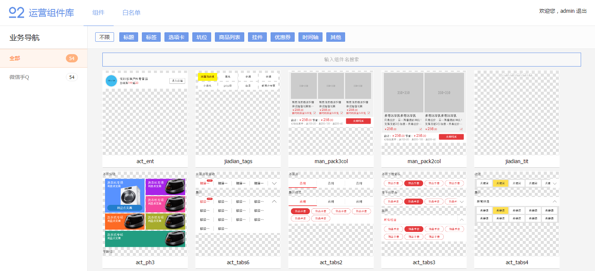

# Athena 组件平台

集合组件上传、组件拉取、和组件预览功能。

* * *

> Athena之父增加了本地的单组件编译功能，所以组件平台的编译将进行最大幅度的精简，且要解决一些稳定使用之后暴露出来的问题，而且，在文哥带领下经历过一轮漫长又艰巨的Vue+Vuex+Webpack业务实践之后，更加感受到组件平台古老的代码方式该有点改变了……敬请期待

> AC要用上VUEX了，马上进入电气时代

* * *

## 技术组成

- 前端 vue2+webpack2
- 后端 koa2+phantomJS
- 数据存储 Leancloud

## 特色功能

- 后台自动截图预览
- 多态编译

## 前端页面展示



## 部署指引

- 安装 NodeJS 6.x
- 安装 phantomJS（>=2.1.1）
- 注册 Leancloud 并配置，[Leancloud 初始化指引](#Leancloud 初始化指引)

截图可能会出现截图里文字不见了的情况，因为——系统没有页面用到的字体，解决：

- 在centos中执行：yum install bitmap-fonts bitmap-fonts-cjk
- 在ubuntu中执行：sudo apt-get install xfonts-wqy
- 安装字体 `STHeiti-Light.ttc` 和 `STHeiti-Medium.ttc`

``` bash
git clone https://github.com/o2team/athena-component.git

cd athena-component
npm install
node install

cd app
npm install
npm run build

cd ../
npm start
```

### 前端 ./app

- 前端配置：`./src/app.js`
- 前端开发：`npm run dev`
- 前端编译：`npm run build`

### 后端

- 后端配置：`./config/*`
- 后端开发：`npm run dev`
- 后端部署：`npm start`
- 工具
  - 清空組件緩存：`babel-node cleanup`

## API

总览：

- HTTP POST /api/push
- HTTP GET  /api/pull/:id/:rename?
- HTTP GET  /api/detail?id=xxx
- HTTP GET /api/detail-info?id=xxx
- HTTP GET /api/business/list
- HTTP GET /api/classify/list

``` javascript
/**
 * HTTP POST /api/push
 * @description 上传组件
 *
 * @param {String} <appId> 应用ID
 * @param {String} <moduleId> 模块ID
 * @param {String} <platform> 平台 pc | h5
 * @param {String} <widget> zip组件打包文件
 * @param {String} <author> 作者，白名单校验
 * @param {String} [description] 描述，默认从组件配置文件中读取
 * @param {String} [business] 所属业务ID
 * @param {String} [classify] 所属分类ID
 * 
 * @response 200 { no:0, data: { id: widgetId } }
 */
```

``` javascript
/**
 * HTTP GET /api/pull/:id/:rename?
 * @description 拉取组件。更直接地 —— /warehouse/id 可直接获取到组件
 * 
 * @param {String} <id> 组件ID
 * @param {String} [rename] 重命名名称
 */
```

``` javascript
/**
 * HTTP GET /api/detail?id=xxx
 * @description 组件详情，返回代码及组件信息
 * 
 * @param {String} <id> 组件ID
 *
 * @response { contHtml, contCss, contJs, widget }
 */
```

``` javascript
/**
 * HTTP GET /api/detail-info?id=xxx
 * @description 组件详情，返回组件信息，不包含代码
 * 
 * @param {String} <id> 组件ID
 *
 * @response widget
 */
```

``` javascript
/**
 * HTTP GET /api/business/list
 * @description 业务列表
 * 
 * @response businesses
 */
```

``` javascript
/**
 * HTTP GET /api/classify/list
 * @description 类别列表
 * 
 * @response classify
 */
```

**Leancloud已提供相关接口，以下API不在后台提供：**

- 组件列表查询
- 白名单列表查询
- 白名单 增/删
- 组件标签 增/删
- 用户登录/登出

为什么有些接口不直接用Leancloud提供的？保证Athena不用另外再配置Leancloud，也方便以后数据迁移。

## Leancloud 初始化指引

*为什么建议手动初始化？`Leancloud` 并不像 `Mongodb` 拥有“版本”的记录，数据在第一次插入时就固定了它的类型，类型是不能被更改的*

字段如无指定，默认类型为 `String`

- _Role，添加一角色 `admin`
- _User，添加一用户 `admin` 并关联至 _Role admin
  - username
  - password
- Business，创建（限制写入）
  - !name
- Classify，创建（限制写入），固定数据 = 标题+标签+选项卡+坑位+商品列表+挂件+优惠券+时间轴+其他
  - !name
- Widget，创建（无限制），限制 _Role admin: delete
  - !name
  - !author
  - !appId
  - !moduleId
  - !platform (default h5)
  - !pullTimes (Number default 0)
  - desc
  - tags (Array)
  - business (Pointer -> Business)
  - classify (Pointer -> Classify)
  - state (Number default 1) 状态，0=已删除
- Account，创建（限制写入），赋予 _Role admin: create, delete, update
  - !name

## 上传组件规范

（待确认）

- 全部或部分：
  - 1个 images 文件夹 + N个图片文件
  - 1个 HTML 文件
  - 1个 CSS / SCSS 文件，如同时存在，SCSS 优先，CSS 被忽略，目前只支持预处理器 `SCSS`
  - 1个 Javascript 文件
  - 1个 JSON 配置文件（必需）
  - 1个 capture.png 截图文件（可选）
- 不包含外层文件夹，无组件依赖
- 除图片文件，所有文件名跟组件名一致
- 组件命名务必要有一定的复杂度，避免跟CSS关键字、JS关键字、HTML标签相同，因为组件的重命名为纯粹的字符串替换
- 配置文件 `data` 字段填写编译组件的必要参数
- 配置文件 `dataList` 字段为多态服务，比 `data` 优先，必须是一个数组，数组子项就相当于一个 `data`

## Athena 平台迭代

饿~饿~饿！

- 组件上传选择 `业务` 和 `分类`
- 组件上传分析SASS依赖，编译SASS
- 组件下载安置SASS依赖
- 组件重命名
- autoprefix


## 其他额

SyntaxHighlighter 自定义编译
 
``` bash
gulp setup-project
gulp build --brushes=css,javascript,sass,xml --theme=default
```

问题归档：

```
Cannot assign to read only property 'exports' of object '#<Object>'
```

[问题解决](http://www.mamicode.com/info-detail-1694072.html)
要配对使用require和module.exports以及import和export default
所以自定义修改了 `brush-base` 的包
